# Fabriquer une TexTime 40 × 40

L'horloge de 40 cm de côté, sans cadre, à façade aimantée. Le montage se fait en six
étapes : la façade, la structure, l'électronique, le firmware, l'assemblage, la mise en
route. Plusieurs chapitres proposent deux approches, à choisir selon l'outillage et le
budget. Le résultat à obtenir :

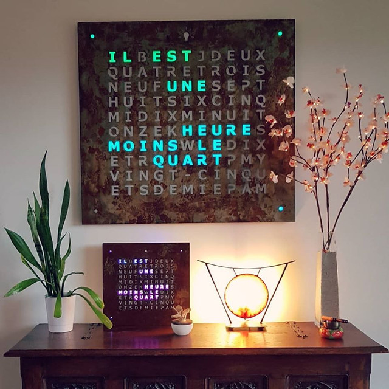

Nomenclature complète : [`bom/40x40.md`](../bom/40x40.md).

## 1. La façade

La façade est une plaque d'acier d'un millimètre, découpée au laser ou au jet d'eau.
Elle vient s'aimanter sur la structure.

### 1.1 Conception

Il faut un fichier DXF, le dessin de la façade.

- **Option 1 : le DXF prêt à l'emploi.** La façade TexTime, en français :
  [`hardware/mechanical/40x40/faceplate-steel-1mm.dxf`](../hardware/mechanical/40x40/faceplate-steel-1mm.dxf).
  Le plan coté est dans [`faceplate-drawing.pdf`](../hardware/mechanical/40x40/faceplate-drawing.pdf).
  Une variante pour de l'acier de 2 mm existe :
  [`faceplate-steel-2mm.dxf`](../hardware/mechanical/40x40/faceplate-steel-2mm.dxf).
- **Option 2 : dessiner la sienne.** Pour une autre langue, une autre police ou un
  autre style de lettres, partir du DXF fourni dans un logiciel de dessin vectoriel ou
  de CAO et ne remplacer que les lettres. Les dimensions de la plaque, les trous et
  l'entraxe de la grille de 11 × 10 lettres et des 4 points de coin doivent rester
  ceux de la façade originale, sinon les lettres ne tombent plus en face des LED. Une
  police « stencil » évite que les intérieurs des lettres fermées, comme le O ou le A,
  ne tombent à la découpe. Le firmware ne connaît que le français et l'anglais ; une
  autre langue demande d'ajouter sa grille dans
  [`textime.h`](../firmware/TexTime/textime.h).

### 1.2 Fabrication

Sans découpeuse laser capable de couper l'acier, il faut passer par un professionnel.
C'est simple et peu coûteux. Une recherche « découpe laser » donne de nombreuses
entreprises ; par exemple :

- https://www.john-steel.com/fr/dxf
- https://laserhub.com/fr
- une société locale, trouvée sur Google

Envoyer un mail avec le DXF en pièce jointe en demandant un devis pour une découpe dans
de l'acier S235 de 1 mm, quantité 1. Comparer plusieurs devis, et privilégier une
société proche pour aller chercher la pièce et éviter les frais de port. Le règlement se
fait en général par virement.

### 1.3 Finition

L'acier S235 rouille naturellement, ce qui donne un style industriel : de nombreux
tutoriels vidéo expliquent comment accélérer la rouille, à stabiliser ensuite par une
couche de vernis. La façade peut aussi être peinte, soi-même ou par un carrossier.

## 2. La structure

La structure est imprimée en 3D. Elle reçoit l'électronique, les LED, la façade, les
câbles. Tout.

### 2.1 Impression

Deux fichiers STL selon la taille du plateau :

- une seule pièce, plateau de 40 × 40 cm minimum :
  [`frame-3dprint-one-piece.stl.zip`](../hardware/mechanical/40x40/frame-3dprint-one-piece.stl.zip)
  (à dézipper avant d'imprimer) ;
- quatre parties à assembler :
  [`frame-3dprint-part1.stl`](../hardware/mechanical/40x40/frame-3dprint-part1.stl),
  [`part2`](../hardware/mechanical/40x40/frame-3dprint-part2.stl),
  [`part3`](../hardware/mechanical/40x40/frame-3dprint-part3.stl),
  [`part4`](../hardware/mechanical/40x40/frame-3dprint-part4.stl).

Sans imprimante, un service d'impression en ligne fait l'affaire avec le fichier une
pièce. Pour limiter le coût : matériau PLA standard, remplissage 20 %, hauteur de couche
0,3 mm.

Dans tous les cas, orienter la pièce face avant vers le bas : la surface en contact avec
la façade doit être côté plateau.

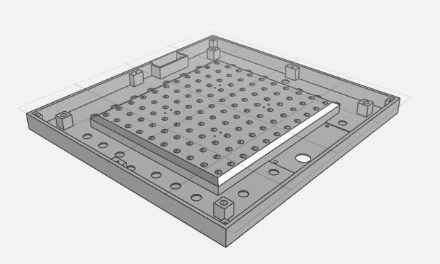

### 2.2 Assemblage des quatre parties

Retirer les brims, puis coller les parties à la colle PVC, celle des gouttières. Des
serre-joints aident, sans trop serrer.

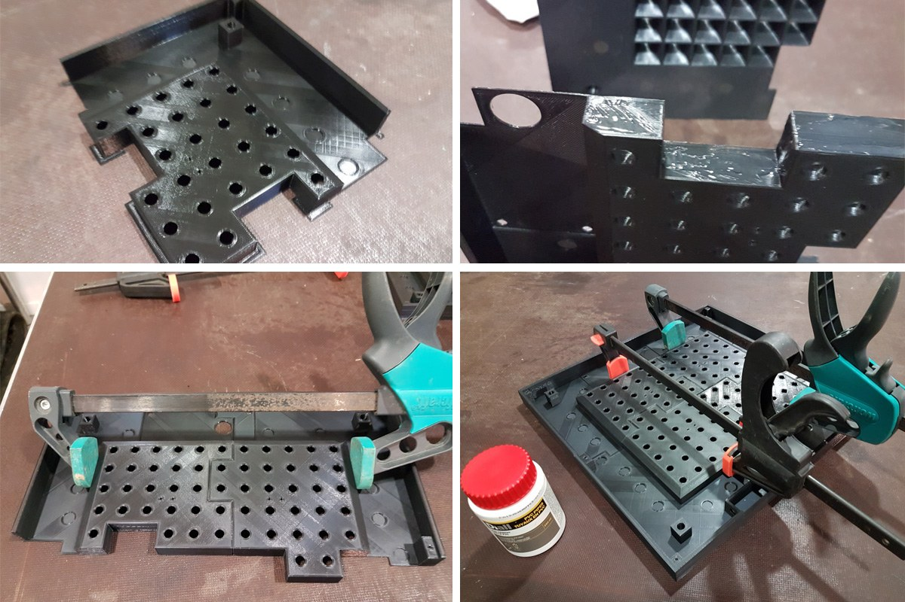

### 2.3 Les aimants

La façade tient par 24 aimants néodyme, idéalement N52, cylindriques de 12 mm de
diamètre et 3 mm d'épaisseur. Chaque aimant se place dans son logement sur la structure ;
un gros point de pistolet à colle par-dessus le maintient.

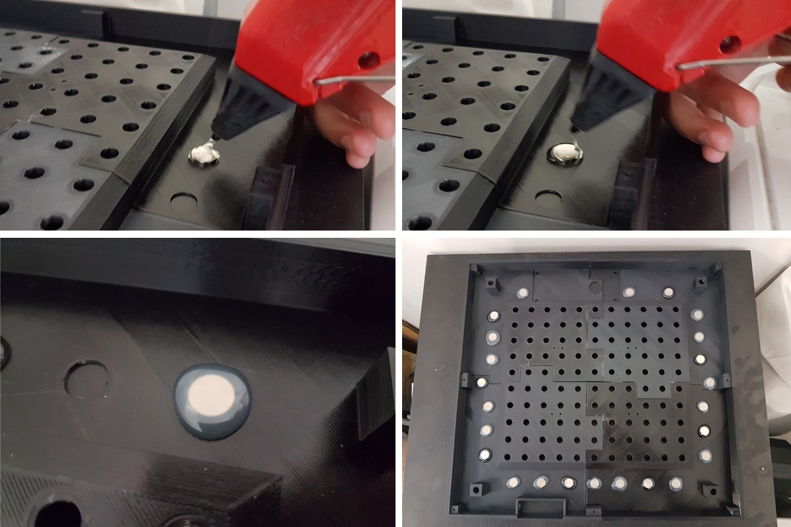

## 3. L'électronique

Deux parties : le circuit de contrôle, et les LED. Tous les fichiers sont dans
[`hardware/electronics`](../hardware/electronics).

Deux montages possibles, à choisir avant de commander :

- **bandeau de LED** : la carte de contrôle `pcb-multi-ledstripe` (3.1) pilote un
  bandeau découpé et raccordé (3.2, option 1) ;
- **carte intégrée** `pcb-40x40-integrated` : un seul PCB porte les 114 LED et toute
  l'électronique de contrôle (3.2, option 2). Il n'y a alors pas de carte de contrôle à
  fabriquer en plus ; le 3.1 ne sert que pour la liste des composants, qui se soudent
  directement sur la carte intégrée.

### 3.1 Le circuit de contrôle

Il s'articule autour d'un ESP8266 pour le WiFi, d'une RTC pour garder l'heure sans
internet, d'un capteur de luminosité qui adapte l'éclairage à la lumière ambiante, et
d'un adaptateur de niveau qui pilote les LED.

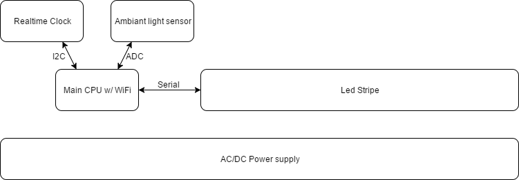

Tous les composants sont traversants pour être faciles à souder, à l'exception du
capteur de luminosité en CMS, qui demande une bonne dextérité. S'il est absent, l'horloge
fonctionne quand même en luminosité manuelle. JLCPCB peut aussi le poser avec les
fichiers `jlcpcb-smt-*.csv` du dossier.

#### 3.1.1 Le PCB

Faire fabriquer le PCB à partir du dossier gerber
[`pcb-multi-ledstripe/gerber.zip`](../hardware/electronics/pcb-multi-ledstripe/gerber.zip).
[JLCPCB](https://jlcpcb.com/) le fait pour pas cher : créer un compte, faire un devis en
ligne, envoyer le zip. Les paramètres par défaut conviennent ; le blanc est recommandé.
Le minimum est de cinq pièces, pour quelques euros port compris. Même chose pour la
carte intégrée de l'option 2 plus bas.

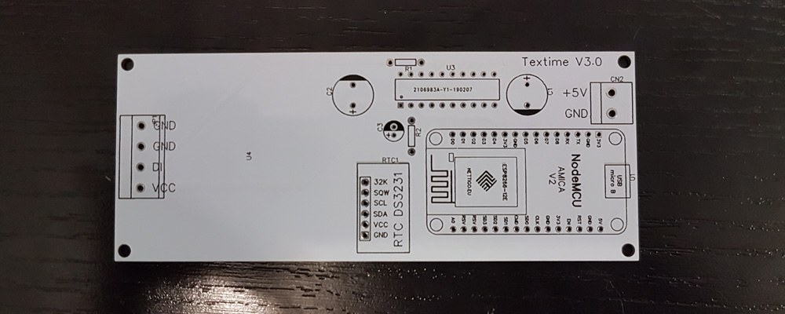

Schéma : [`schematic.png`](../hardware/electronics/pcb-multi-ledstripe/schematic.png).
Rendus : [`pcb-top.png`](../hardware/electronics/pcb-multi-ledstripe/pcb-top.png),
[`pcb-bottom.png`](../hardware/electronics/pcb-multi-ledstripe/pcb-bottom.png).

#### 3.1.2 Soudure

La liste des composants est dans [`bom/40x40.md`](../bom/40x40.md) et dans
[`pcb-multi-ledstripe/bom.csv`](../hardware/electronics/pcb-multi-ledstripe/bom.csv).

- Souder la RTC et les condensateurs de 1000 µF à plat, sinon le circuit est trop haut
  et dépasse de la structure.
- Attention à la polarité des condensateurs.
- Avec cinq PCB et des composants en quantité, plusieurs essais sont possibles.

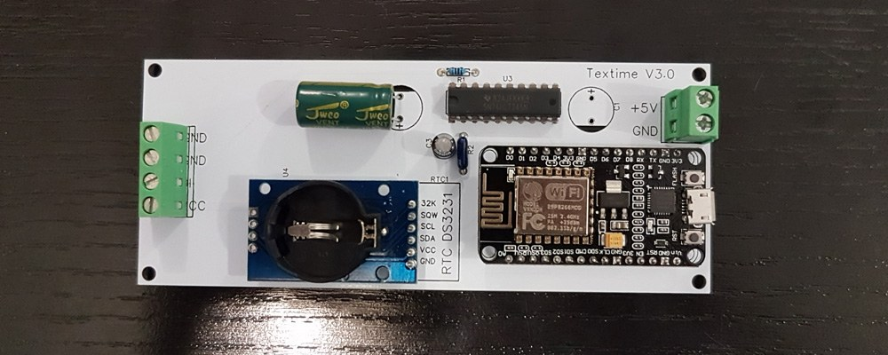

#### 3.1.3 Alimentation

L'horloge fonctionne en 5 V et consomme jusqu'à 5 A. Il faut donc un bloc secteur
5 V 5 A, connecté au bornier CN2, sans se tromper de polarité.

Sur Aliexpress, choisir « 5V », « EU Plug », « 5A ». Acheter en même temps l'embase
femelle DC-022B 5,5 × 2,1 mm, qui se fixe sur la structure. Contrôler au multimètre la
position de la masse et du 5 V sur l'embase avant de la câbler.

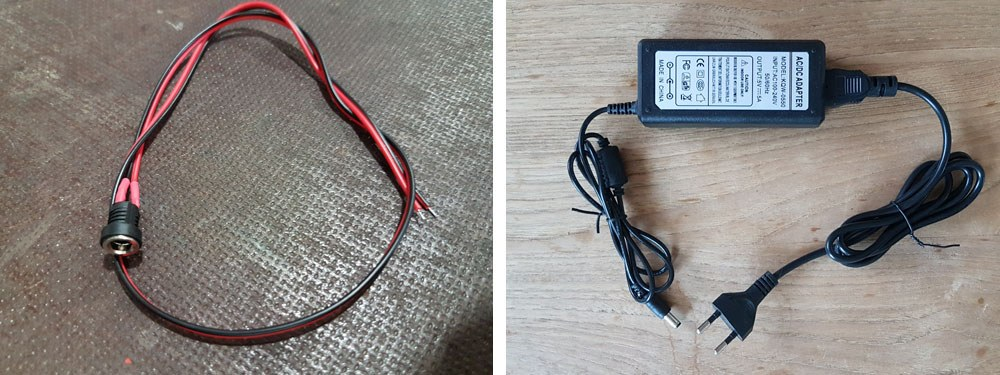

### 3.2 Les LED

Deux approches. La première est recommandée pour son coût et sa simplicité.

#### Option 1 : le bandeau de LED

L'horloge compte 110 lettres et 4 points aux coins, soit 114 LED. Il faut un bandeau à
30 LED par mètre, indice IP30 : 4 mètres, donc l'option « 4m 30 IP30 » ou
« 5m 30 IP30 ». Prendre aussi du câble 4 fils pour relier les sections (« 5m 4pin
cable »).

Privilégier un bandeau **SK6812 RGBW 5 V** : de meilleure qualité que les
WS2812/WS2813, avec une LED blanche dédiée que le firmware utilise pour le texte blanc.
Un bandeau WS2813 fonctionne aussi. Dans les deux cas, le type se choisit ensuite dans
les paramètres généraux, « Type de LED ».

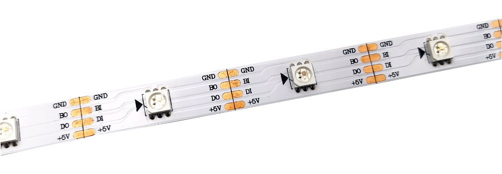

Le bandeau se coupe entre chaque LED. Des flèches indiquent le sens du signal : il faut
le respecter à chaque raccord. Couper les sections suivantes :

| Longueur de section (LED) | 1 | 2 | 3 | 4 | 5 | 6 | 7 | 8 | 9 | 10 |
|---|---|---|---|---|---|---|---|---|---|---|
| Nombre de sections | 6 | 2 | 2 | 2 | 2 | 2 | 2 | 2 | 2 | 2 |

Les sections se posent en diagonale sur la structure, en partant du coin en haut à
droite de la matrice et en finissant au coin en bas à gauche, dans l'ordre 1, 2, 3 … 10,
10, 9 … 2, 1. Les quatre LED seules restantes vont sur les points 1, 2, 3 et 4 des
coins. Longueur de câble entre chaque section, dans l'ordre du signal, à partir du PCB :

| Raccord | PCB→1 | 1→2 | 2→3 | 3→4 | 4→5 | 5→6 | 6→7 | 7→8 | 8→9 | 9→10 | 10→10 | 10→9 | 9→8 | 8→7 | 7→6 | 6→5 | 5→4 | 4→3 | 3→2 | 2→1 | 1→coin 1 | coin 1→2 | coin 2→3 | coin 3→4 |
|---|---|---|---|---|---|---|---|---|---|---|---|---|---|---|---|---|---|---|---|---|---|---|---|---|
| cm | 25 | 17 | 27 | 37 | 47 | 57 | 67 | 77 | 87 | 97 | 107 | 107 | 97 | 87 | 77 | 67 | 57 | 47 | 37 | 27 | 19 | 135 | 135 | 135 |

Quelques remarques :

- Respecter le sens des flèches d'une section à l'autre.
- Reboucler le +5 V et le GND de la dernière LED sur la première : cela réduit la chute
  de tension le long du ruban, visible sinon en blanc à pleine luminosité.
- Étamer les câbles avec du flux, et mettre de l'étain sur les contacts des sections
  avant de les souder ensemble.

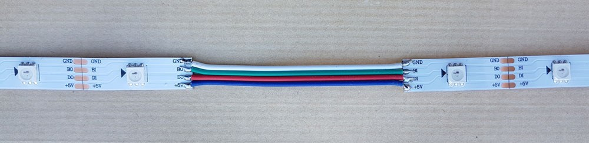

L'ordre des LED attendu par le firmware est celui de `LedConfiguration40x40` dans
[`LedStrip.h`](../firmware/TexTime/LedStrip.h).

#### Option 2 : la carte intégrée

Au lieu d'un bandeau, un grand PCB porte les 114 LED et tout le circuit de contrôle :
NodeMCU, RTC, capteur de luminosité, adaptateur de niveau, condensateurs, bornier
d'alimentation. Il remplace donc la carte `pcb-multi-ledstripe`, qu'il n'y a pas à
fabriquer. Plus de découpe ni de raccords, mais 114 LED à souder une à une.

Faire fabriquer le PCB comme au 3.1.1 avec
[`pcb-40x40-integrated/gerber.zip`](../hardware/electronics/pcb-40x40-integrated/gerber.zip). La LED est
la **WS2813B-B**, le suffixe B-B est important : c'est le brochage du PCB. Pour une
autre WS2813, vérifier le brochage sur la datasheet. TME ou LCSC de préférence, 114 plus
quelques-unes de rechange. Un petit triangle sur la LED indique son sens : le coin
biseauté doit correspondre à celui du dessin du PCB. Les composants de contrôle sont
ceux de la liste du 3.1.2, à souder sur cette carte ; le bornier 4 broches y sert au
raccordement de l'alimentation.

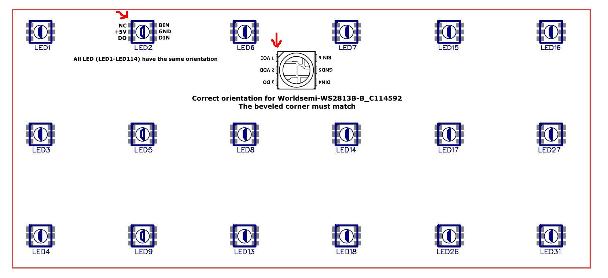

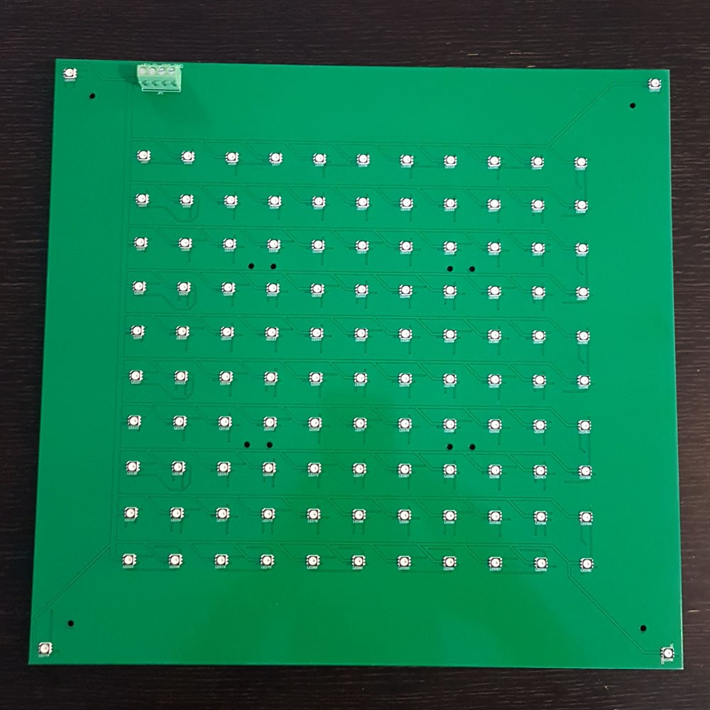

Schémas et rendus dans [`hardware/electronics/pcb-40x40-integrated`](../hardware/electronics/pcb-40x40-integrated),
photos du montage dans [`photos`](../hardware/electronics/pcb-40x40-integrated/photos).

## 4. Le firmware

Le circuit de contrôle repose sur une carte NodeMCU, bâtie sur l'ESP8266, pleinement
supporté par l'environnement Arduino.

Au démarrage, l'horloge charge sa configuration et se connecte au WiFi enregistré. Si
elle ne le trouve pas, ou n'a pas de configuration, elle devient elle-même point
d'accès. On s'y connecte depuis un téléphone ou un ordinateur, on ouvre
`http://192.168.1.1/` et on saisit les paramètres WiFi. Ensuite elle se met à l'heure
seule par NTP.

Il faut d'abord flasher le processeur une première fois :

- **Option 1 : le binaire.** Télécharger `TexTime.bin` sur la
  [page des releases](../../../releases). Brancher le
  NodeMCU en USB, lancer
  [nodemcu-pyflasher](https://github.com/marcelstoer/nodemcu-pyflasher), choisir le
  fichier et le port COM, cliquer « Flash NodeMCU ». Une LED bleue qui clignote à la fin
  signifie que tout s'est bien passé. Les mises à jour suivantes se font depuis
  l'interface web.
- **Option 2 : compiler.** Pour qui connaît Arduino. Installer le support ESP8266 et les
  bibliothèques listées dans
  [`firmware/TexTime/README.md`](../firmware/TexTime/README.md), ouvrir le sketch,
  compiler, flasher. Corrections et nouvelles fonctions sont bienvenues en pull request.

## 5. L'assemblage

### 5.1 Alimentation et circuit de contrôle

Fixer l'embase et le câble d'alimentation sur la structure ; un point de colle chaude
maintient le câble.

Avec le bandeau, fixer ensuite la carte de contrôle par quatre vis M3 × 12 à tête
fraisée et écrous nylstop. Le capteur de luminosité, sur l'autre face du PCB, doit se
trouver exactement au milieu du trou prévu dans la structure. Insérer le câble
d'alimentation dans le bornier : rouge sur +5 V, noir sur GND.

Avec la carte intégrée, il n'y a pas de carte de contrôle à fixer : le câble
d'alimentation ira sur le bornier de la carte intégrée au 5.2.

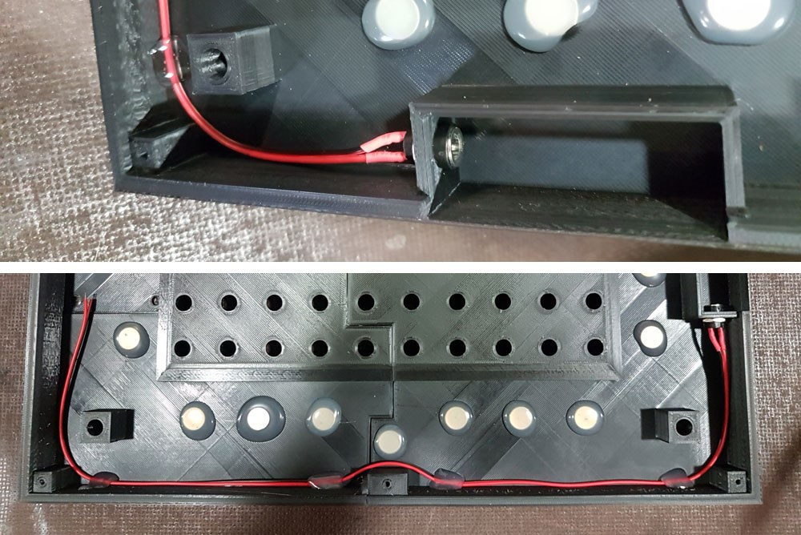

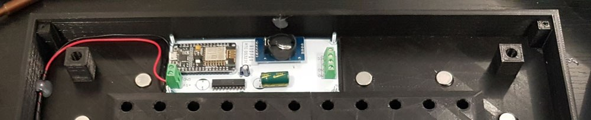

### 5.2 Les LED

- **Bandeau :** poser les sections en diagonale comme décrit au 3.2, du coin en haut à
  droite (début) au coin en bas à gauche (fin), puis les quatre LED des coins dans
  l'ordre 1, 2, 3, 4. Câbler le début du bandeau au bornier du circuit de contrôle en
  respectant l'ordre des fils. Du scotch aide à maintenir le bandeau sur la structure.
- **Carte intégrée :** câbler l'alimentation sur son bornier (rouge sur +5 V, noir sur
  GND), la retourner et la poser dans la structure. Chaque LED doit tomber dans son
  trou, et le capteur de luminosité au milieu du trou prévu pour lui.

Dans les deux cas, mettre la pile CR2032 dans la RTC avant de fermer.

Bandeau posé, du début en haut à droite à la fin en bas à gauche, puis les coins 1 à 4 :

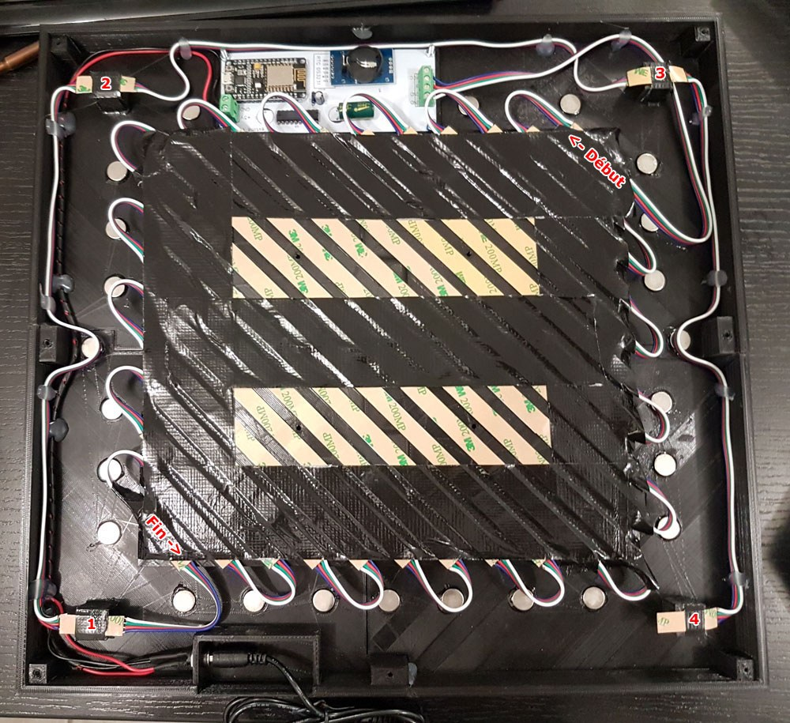

Carte intégrée posée dans la structure :

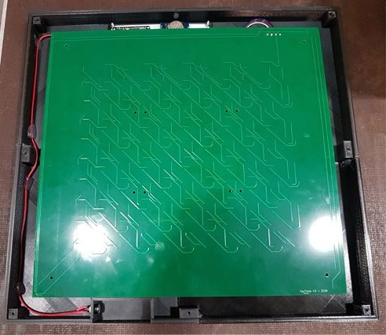

### 5.3 Le capot arrière

Le capot solidarise la structure et les LED et donne un aspect fini. Le faire découper
dans du MDF de 3 mm avec
[`back-cover-mdf-3mm.dxf`](../hardware/mechanical/40x40/back-cover-mdf-3mm.dxf), puis le
fixer avec onze vis à bois 3 × 12 mm.

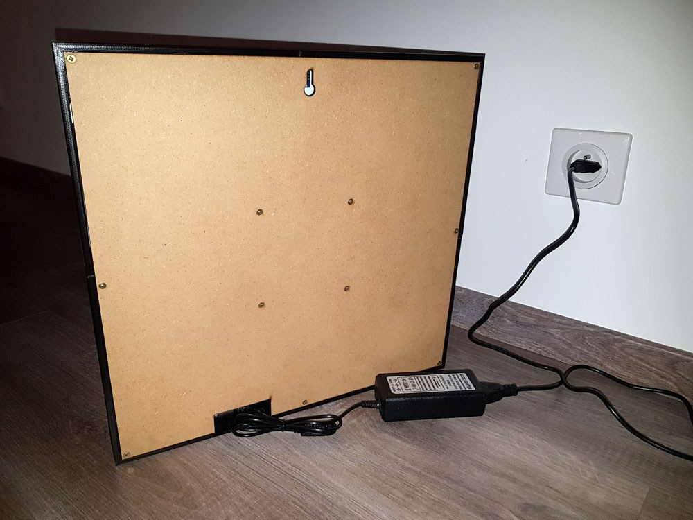

### 5.4 La façade

Avant d'approcher la façade, placer un diffuseur : du papier sulfurisé, celui de la
cuisine, dont l'opacité est idéale. En découper un morceau à la taille de la façade moins
1 cm de chaque côté et le scotcher sur la face avant de la structure. Il ne reste qu'à
approcher la façade, qui s'aimante.

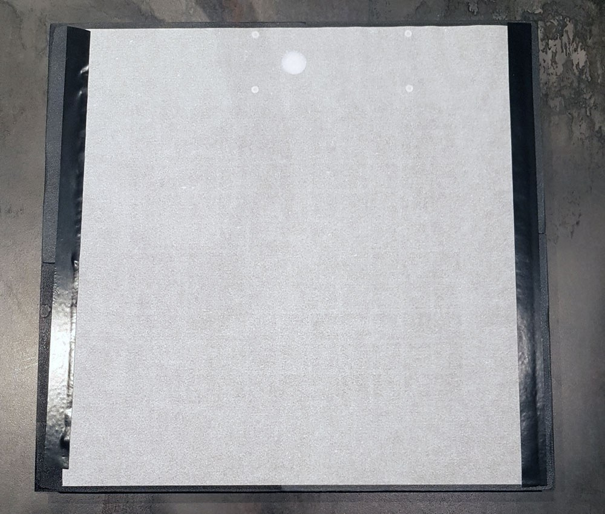

## 6. Mise en route

Brancher l'horloge. La première fois, elle n'est pas à l'heure : chercher le réseau WiFi
`TexTime-XXXX`, s'y connecter, ouvrir `http://192.168.1.1/`, et dans les paramètres
réseau entrer son WiFi. Une fois connectée, elle se met à l'heure. On la retrouve
ensuite sur le réseau par son adresse IP ou `http://textime/`. Les paramètres généraux
donnent accès aux couleurs, animations, langues, au type d'horloge et au type de LED :
régler ce dernier sur le bandeau posé, SK6812 ou WS2813, sinon les couleurs sont
fausses.

Pour vérifier le montage, trois modes d'affichage de test :

- **Test Strip** : chaque LED s'allume à tour de rôle dans l'ordre du bandeau, en
  diagonale. Une LED qui reste éteinte est à remplacer.
- **Test Speed** : les LED s'allument le plus vite possible ligne par ligne, de gauche
  à droite ; à chaque tour un des quatre coins s'allume dans le sens horaire. Si ce
  n'est pas ce qui s'affiche, Test Strip dira quelle LED cloche.
- **Test Colors** : toutes les LED passent en rouge, vert, bleu puis blanc. Un défaut de
  couleur en blanc signifie qu'il faut reboucler l'alimentation de la dernière LED sur la
  première.
